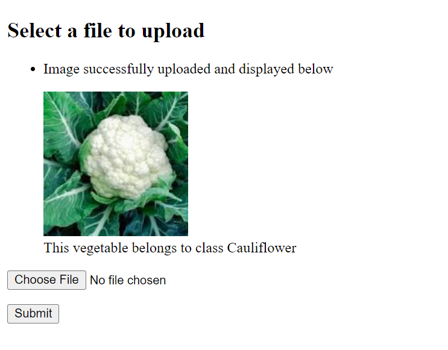

# Classify vegetables using image2vec module available in weaviate

To run this on your machine:
1. Make sure you have docker and get familiar with docker-compose
2. Using the docker-compose file, spin up a weaviate instance along with image2vec module.
3. Make sure to have the following python libraries installed, preferably in a virtual environment:
   a. weaviate
   b. pickle
   c. uuid
   d. flask
   e. urllib
4. To add data to weaviate, run the veg_add.py file. This will add images from the folders that you 
   mentioned in that file. You can add your own images too or use the dataset of your choice by just making a few small changes in the veg_add.py file. I have used a kaggle dataset (https://www.kaggle.com/datasets/misrakahmed/vegetable-image-dataset) to make this example.

**NOTE: Please make sure to change the image paths and uploads folder paths in veg_add.py file and upload.py file so as to avoid file not found errors.**

5. Now, to test the application, run the app.py file. This will start a flask server where you can upload an
   image and the application will classify it and display the class of vegetable it belongs to. 
6. You are encouraged to play with the code, make changes, test it, and have fun with weaviate 😇!!

